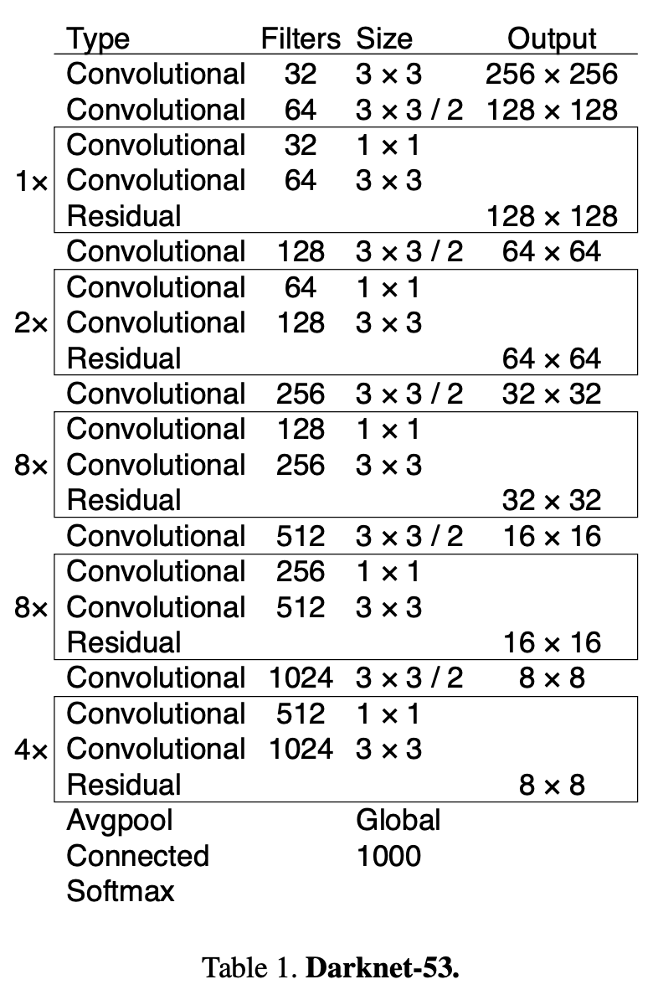

# DarkNet53 (Dog & Cat)

This is implementation of Darknet53 network discussed in YOLOv3.  

The DarkNet53 was used in YOLOv3 as a backbone network.  

In this work, the DarkNet53 is used to classify the dog and cat.  

Pretrained model: [Download](https://drive.google.com/file/d/1yuhFwq1nKTnEiIPeKvQQA88-2rsLQGva/view?usp=sharing)

